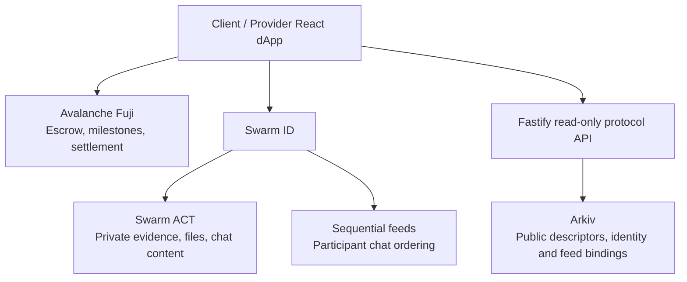

# MilestonePay

MilestonePay lets clients fund a milestone escrow upfront while providers deliver private work, chat privately, and resolve disputes with verifiable settlement history.

## Problem

Freelance milestones need both financial certainty and privacy. Public storage leaks deliverables; centralized chat and file servers weaken the protocol story.

## Solution

Avalanche Fuji holds the financial state. Swarm ACT protects private deliveries and messages. Two participant-owned Swarm sequential feeds persist private-chat pointers. Arkiv indexes only public protocol and discovery metadata. Reputation is a deterministic summary of verifiable interaction history, not a judgement of a person.

## Demo flow

1. Create and fully fund an agreement on Fuji.
2. Bind participant Swarm identities and exchange private messages.
3. Provider submits a private note and files; client downloads and approves.
4. Open a dispute, seal only selected evidence for the arbiter, then resolve on-chain.
5. Open participant reputation to inspect the resulting protocol history.

## Privacy architecture



Arkiv never stores chat text, file bytes, ACT secrets, or private Swarm material. Fastify never receives them. An arbiter does not receive normal chat access; they receive only evidence explicitly sealed for a dispute.

## Core features

- Full-upfront Avalanche milestone escrow, approvals, disputes and arbiter settlement.
- ACT-protected text and multi-file deliveries with integrity verification.
- Private client/provider chat: ACT content plus participant-owned sequential feeds.
- Arkiv-backed protocol discovery and deterministic, explainable reputation.
- Browser storage is optional UI state only; protocol state recovers from Avalanche, Arkiv and Swarm.

MilestonePay is a Fuji-ready ERC-20 milestone escrow with private Swarm ACT evidence transport, a trusted Arkiv protocol index, and deterministic reputation scoring. MockUSDT is a test token only, never Tether USDT.

## Requirements

- Docker and Docker Compose v2+
- pnpm 12.4.1 and Node.js 24 LTS for development outside Docker
- [Foundry](https://getfoundry.sh/getting-started/installation) for contract commands

## Local setup

```bash
cp .env.example .env
docker compose up
```

Frontend → http://localhost:5173

Backend → http://localhost:3001 (`GET /health` returns `{"status":"ok"}`)

Arkiv connectivity → http://localhost:3001/arkiv/health

Compose builds the images and installs dependencies automatically. Only `web` and `api` run. The page polls backend health every five seconds. Source edits reload both applications; Vite uses polling for Docker bind mounts. Rebuild with `docker compose up --build` after dependency changes. Stop with Ctrl+C or `docker compose down`.

For development without Docker (stop Compose first):

```bash
pnpm install
pnpm dev
```

Both applications read the root `.env`. `pnpm build`, `pnpm lint`, and `pnpm test` run workspace checks. The root test command runs the API smoke test; Foundry tests are separate.

## Contracts

After cloning, initialize the pinned Foundry dependencies (or clone with `--recurse-submodules`):

```bash
git submodule update --init --recursive
cd contracts
forge build
forge test
```

`src/MilestoneEscrow.sol` implements full upfront funding and sequential client-approved releases. Client, provider, and arbiter must be distinct. `src/EscrowFactory.sol` deploys agreements using the caller as client. `src/testnet/MockUSDT.sol` is a mintable six-decimal Fuji demo token only, not Tether USDT.

V1 has no automatic provider-delivery deadline: the client can dispute the current pending milestone for arbiter resolution. A submitted milestone has a per-escrow review period; after it expires, the provider can claim that milestone's payment.

Deploy after adding a funded testnet deployer key to your untracked `.env`:

```bash
cd contracts
forge script script/DeployFuji.s.sol:DeployFuji \
  --rpc-url "$FUJI_RPC_URL" --broadcast
cd ..
pnpm contracts:sync-fuji
```

`pnpm contracts:export` deterministically regenerates TypeScript ABIs with `forge inspect`; `pnpm contracts:sync-fuji` additionally reads Foundry's Fuji broadcast record and writes the two public deployment addresses to `packages/contracts/src/addresses.ts`.

The verified Fuji deployment is the canonical application configuration exported by `@milestonepay/contracts`:

- MockUSDT (test token): `0x42af675aE147084A063058edEDdc729C9F1FbF35`
- EscrowFactory: `0xEe7328dC4002742D3e50DA2eED62B98f7Ab2F003`

The frontend consumes those generated addresses directly; no Vite address override is required. Never place `DEPLOYER_PRIVATE_KEY` in a `VITE_` variable.

## Layout

- `apps/web`: Vite, React, TypeScript, React Router, Tailwind, wagmi, viem, and the generated shadcn preset. `/`, `/create`, and `/deal/:address` are the current wallet routes.
- `apps/api`: Fastify API, read-only Avalanche indexer, trusted Arkiv writer/queries, and protocol materialization.
- `contracts`: Foundry sources, tests, scripts, and dependencies.
- `packages/shared`: reserved shared types/utilities.
- `packages/contracts`: generated ABI/address artifacts consumed by the frontend.
- `packages/evidence`: browser-safe Swarm ACT descriptor, commitment, and identity utilities.
- `packages/reputation`: pure deterministic reputation algorithm; it has no RPC, Arkiv, Fastify, AI, or environment dependency.

The home route lives in `apps/web/src/routes/home.tsx`; future routes can be added in `App.tsx` for `/dashboard`, `/create`, `/deal/:address`, and `/reputation/:address`.

Frontend initialized with exactly:

```bash
pnpm dlx shadcn@latest init --preset bOMBne8iA --template vite
```

## Data pipeline and API

Avalanche is the canonical financial protocol history. `pnpm api:sync` reads Factory-created Fuji escrows from block `58333416`, replays a conservative overlap, writes idempotent canonical event identities to Arkiv, and materializes immutable latest deal/dispute snapshots plus one settlement per milestone. The Avalanche reader uses `FUJI_RPC_URL` only and never signs transactions.

Arkiv stores public protocol history and public evidence descriptors. All official reads constrain `project`, schema version, entity type, and the immutable trusted Arkiv writer address. The configured `ARKIV_PRIVATE_KEY` is server-only and is used solely to create official Arkiv entities. The 180-day testnet TTL is centralized in the API schema.

Available routes: `GET /health`, `GET /arkiv/health`, `GET /deals/:escrow`, `GET /wallets/:address/history`, `GET /wallets/:address/reputation`, `GET /evidence/:hash`, and `POST /evidence`.

`POST /evidence` accepts a public V1 descriptor only. It recomputes its keccak256 commitment and verifies the matching milestone/dispute hash directly on the canonical escrow. It never accepts files, plaintext evidence, ACT secrets, or Swarm identity private material. Swarm ID + ACT remains browser-side; no custom gateway is required.

## Environment and security

Copy `.env.example`; do not commit `.env`. All `VITE_` values are public browser configuration. Swarm ID uses `VITE_SWARM_ID_ORIGIN`; do not configure a custom gateway. Arkiv access and private keys plus `AI_API_KEY` are backend-only: Compose passes only the listed public variables to the web container, and excludes environment files from image builds. Never prefix a secret with `VITE_`. `ARKIV_RPC` defaults to Tiramisu; set `ARKIV_ACCESS_KEY` for higher rate limits and a funded `0x` `ARKIV_PRIVATE_KEY` for protocol indexing.

`PORT` defaults to 3001; Compose keeps the backend host port at 3001. `CORS_ORIGIN` defaults to `http://localhost:5173`. When running without Docker, changing `PORT` also requires updating `VITE_API_URL`. Restart services after changing environment values.

## Architecture

- Avalanche → canonical financial settlement and protocol events
- Swarm ID + ACT → browser-side private evidence transport and access control
- Arkiv → trusted public protocol index, descriptors, and reputation inputs
- Reputation → deterministic, token-aware scoring with explainable factors
- AI → planned explanation layer only; it has no role in evidence, indexing, or scoring
